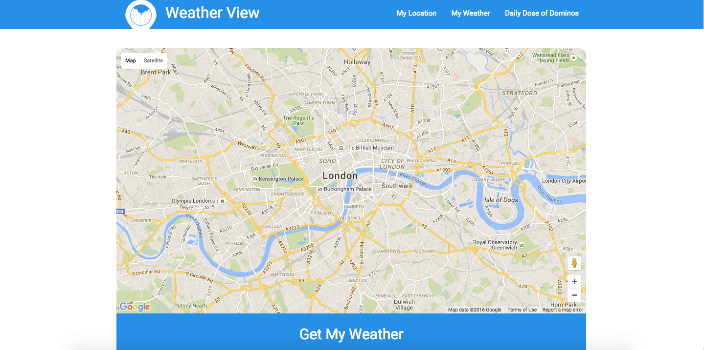
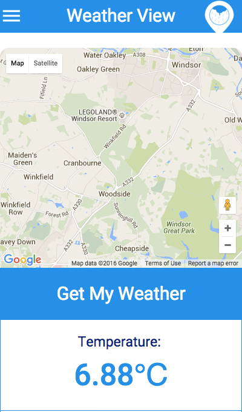
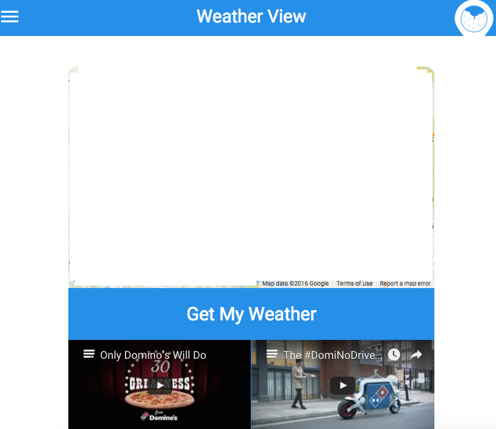

#Weather View

This application is powered by Google Maps API and Open Weather Map API. It detects your browser location upon permission and displays your location on map and local weather information, including 3 videos. 



##Task

- Build a responsive page which takes the user’s location (browser location) and loads a google map with a pin dropped at that location.

- This map will be no larger than 960px wide on desktop, 600px wide on tablet and full width on mobile.

- There will be a series of 6 smaller boxes (with a 1px border) below which will be aligned as 3 x 2 on desktop, 2 x 3 for tablet and single column on mobile.

- Using the location and a weather API, put the temperature in the first box, the day condition (sunny, raining, etc) in the second box and the wind in the 3rd box.

- Place a different video in each of the last 3 box that will play within its own box. If a video is already playing and another is selected then the first should stop playing before the selected video begins.

- Finally add a responsive menu. On desktop it will be a row of links whilst on tablet and mobile it will be a slide out (off canvas) menu. You may use either Javascript, a JS library or CSS animations.

*Optional: The links in the menu scroll to the map, weather or videos.  If you know SASS then you are welcome to use it along with a JS linter and compressor. 

## The build
- JavaScript and jQuery
- HTML and CSS
- CSS/SASS Frameworks: Materialize.css and Animate.css
- APIs: 
  - Google Maps API (with HTML5 Geolocation), 
  - Open Weather Map API, 
  - YouTube iframe API

  
##The process
1. Created very basic wireframes on paper
2. Setup files and folder structure
3. Required scripts, stylesheets and external scripts and stylesheets such as jQuery and Materialize.css
2. Assembling Google Maps API with HTML5 Geolocation
3. Inserting Open Weather Maps API by making a request with the longitude and latitude data gained from Google Maps API
4. Inserting iframe API to display the videos in html file
5. Styling left until functionality was incorporated



##Problems, Wins and Losses
#### Connecting Google Maps API with Open Weather Map API
- One of my problems was to figure out how to incorporate the longitude and latitude data gained from the Google Maps API into the Open Weather Map API request to retrieve weather data for the location
- The longitude and latitude data was contained as key-value pairs within an object named ```pos```.
- Inititally I thought that by making the longitude and latitude into global variables by declaring them outside the functions and only calling them in functions might solve the problem. By doing so, it broke the code. 
- On reading about objects, I thought if I removed the variable attached to the longitude and latitude within the ```pos``` object, this would make it more reusable in other parts of the code. This solution worked and I was able to retrieve the weather data on longitude and latitude successfully.

#### Another small achievement
- By removing any references to infoWindow provided by Google Maps HTML 5 Geolocation function, I was able to only place and display the marker provided by Google Maps API


#### Making an AJAX request to the Open Weather Map API
- Initially, I had inserted a button that onlick a function that made request to Open Weather Map and retrived stringified JSON data
- My next step was to refactor this code into an AJAX  request that would also fire a function to display the selected data: wind, temperature and condition in index.html file
- My AJAX requests initially kept failing. I researched on the jQuery website without success. Having researched further on Stackoverflow I found that I was missing the ```dataType: 'json'``` parameter including the ```success``` parameter that would fire the function to display the selected data in the html file.

#### Failed to incorporate functionality when a video is already playing and another is selected then the first should stop playing before the selected video begins.

- After researching on this functionality and coming across an article on HTML events for YouTube videos, I discovered I could potentially use YouTube's iframe API and check for whether a video was playing or not based on listening to events
- My thought proces on this was the following when reading through the iframe API documentation was the following: 
       - User clicks on first video
       - Listen to this event by adding an event listener
       - Upon listening to this event, fire a funtion that checks whether any of the three videos are playing e.g. current video attribute?
       - If the above condition is true (YT.PlayerState.PLAYING === 1) then call the player.stopVideo() or player.pauseVideo() functions
       - Once the other videos have stopped playing, the video that has been selected by the user can be fired to play through a function called event.target.playVideo();
- However, after unsuccessful attempts, I discovered a solution online on Stackoverflow and on JSFiddle. According to the source, this would be a solution: 

```
<!DOCTYPE html>
<html>
    
    <head>
        <title></title>
        <meta http-equiv="Content-Type" content="text/html; charset=UTF-8">
        <script type="text/javascript" src="http://www.youtube.com/player_api"></script>
    </head>
    
    <body>
        <div>TODO write content</div>
        <ul class="image-grid" id="list">
            <li>
                <iframe class="yt_players" id="player0" width="385" height="230" src="http://www.youtube.com/embed/on4DRTUvst0?rel=0&wmode=Opaque&enablejsapi=1;showinfo=0;controls=0"
                frameborder="0" allowfullscreen></iframe>
            </li>
            <li>
                <iframe class="yt_players" id="player1" width="385" height="230" src="http://www.youtube.com/embed/on4DRTUvst0?rel=0&wmode=Opaque&enablejsapi=1;showinfo=0;controls=0"
                frameborder="0" allowfullscreen></iframe>
            </li>
            <li>
                <iframe class="yt_players" id="player2" width="385" height="230" src="http://www.youtube.com/embed/on4DRTUvst0?rel=0&wmode=Opaque&enablejsapi=1;showinfo=0;controls=0"
                frameborder="0" allowfullscreen></iframe>
            </li>
        </ul>
    </body>

</html>

```

- The following JavaScript functions would have fulfilled the criteria for this task.


```
players = new Array();

function onYouTubeIframeAPIReady() {
    var temp = $("iframe.yt_players");
    for (var i = 0; i < temp.length; i++) {
        var t = new YT.Player($(temp[i]).attr('id'), {
            events: {
                'onStateChange': onPlayerStateChange
            }
        });
        players.push(t);
    }

}
onYouTubeIframeAPIReady();


function onPlayerStateChange(event) {

    if (event.data == YT.PlayerState.PLAYING) {
        //alert(event.target.getVideoUrl());
       // alert(players[0].getVideoUrl());
        var temp = event.target.getVideoUrl();
        var tempPlayers = $("iframe.yt_players");
        for (var i = 0; i < players.length; i++) {
            if (players[i].getVideoUrl() != temp) players[i].stopVideo();

        }
    }
}

```

- However, I resisted to incorporate this solution into my code as I would not have come on to this solution through my own coding. But I do understand that the ```getVideoURL``` function determines whether a video is playing or not.

####Improvements
- I could have refactored the code into AngularJS and made http requests instead of AJAX requests
- I could have perhaps implemented testing frameworks, however I was unsure how to use Mocha and Chai for an application that has no back-end
- The order of my code in my app.js file could have been neater as I load jQuery functions after my Google Maps-related JavaScript functions


####Other considerations
- I did consider building a Node.js back-end however I thought it wasn't necessary as was only requesting data for one location, which is the browser location and I thought it was not worth saving that data into a database


